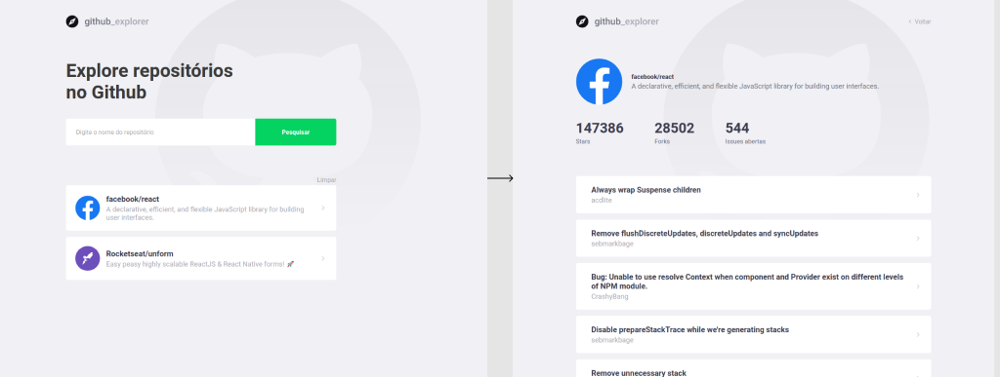

<h1 align="center">
    
</h1>

<p align="center">
  <a href="#bookmark-tecnologias">Tecnologias</a>&nbsp;&nbsp;&nbsp;|&nbsp;&nbsp;&nbsp;
  <a href="#-projeto">Projeto</a>&nbsp;&nbsp;&nbsp;|&nbsp;&nbsp;&nbsp;
  <a href="#rocket-como-utilizar">Getting Started</a>
</p>

<br>

<p align="center">
  
</p>

## :bookmark: Tecnologias

- [React](https://reactjs.org)

## 💻 Projeto

O Github Explorer é um projeto realizado durante o bootcamp Gostack da Rocketseat e é utilizado para buscar repositórios do Github e listar suas issues.

## :rocket: Como utilizar

Faça o clone deste repositório:

```
git clone https://github.com/lucaslds94/Github-explorer.git
```

Execute o comando yarn install ou npm install para adicionar as dependências do projeto.
```

Execute o comando yarn start ou npm start para executar o projeto.
```

---

<h5 align="center"> 🚀 Github Explorer - Lucas Lima </h5>
